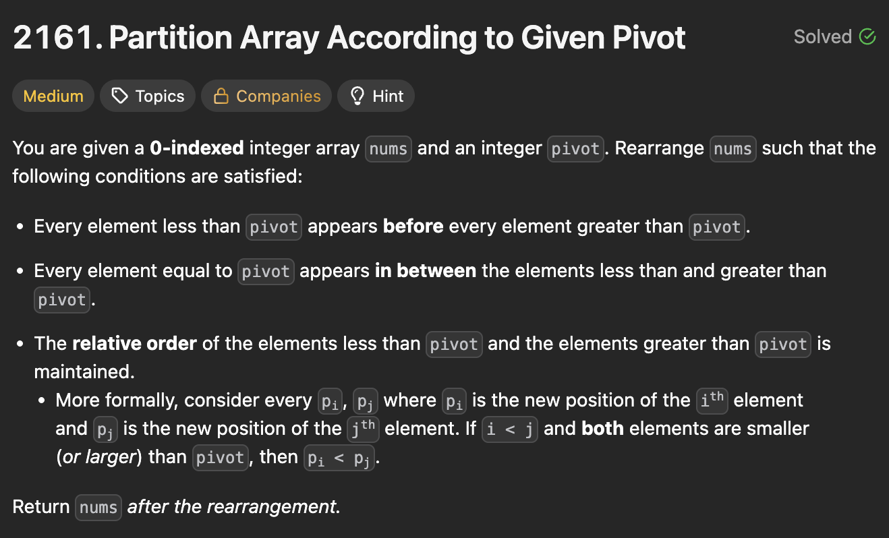

# 2161. Partition Array According to Given Pivot

https://leetcode.com/problems/partition-array-according-to-given-pivot/description/

## About

Конкатенация левой, центральной и правой частей входных данных

## Solved screenshot

