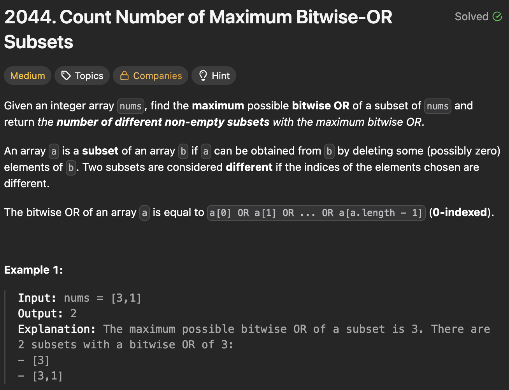

# 2044. Count Number of Maximum Bitwise-OR Subsets

https://leetcode.com/problems/count-number-of-maximum-bitwise-or-subsets/description/

## About

Генерируем всевозможные комбинации подмассивов и считаем их побитовое ИЛИ. Если полученное значение равно максимальному, то увеличиваем счетчик.

## Solved screenshot

