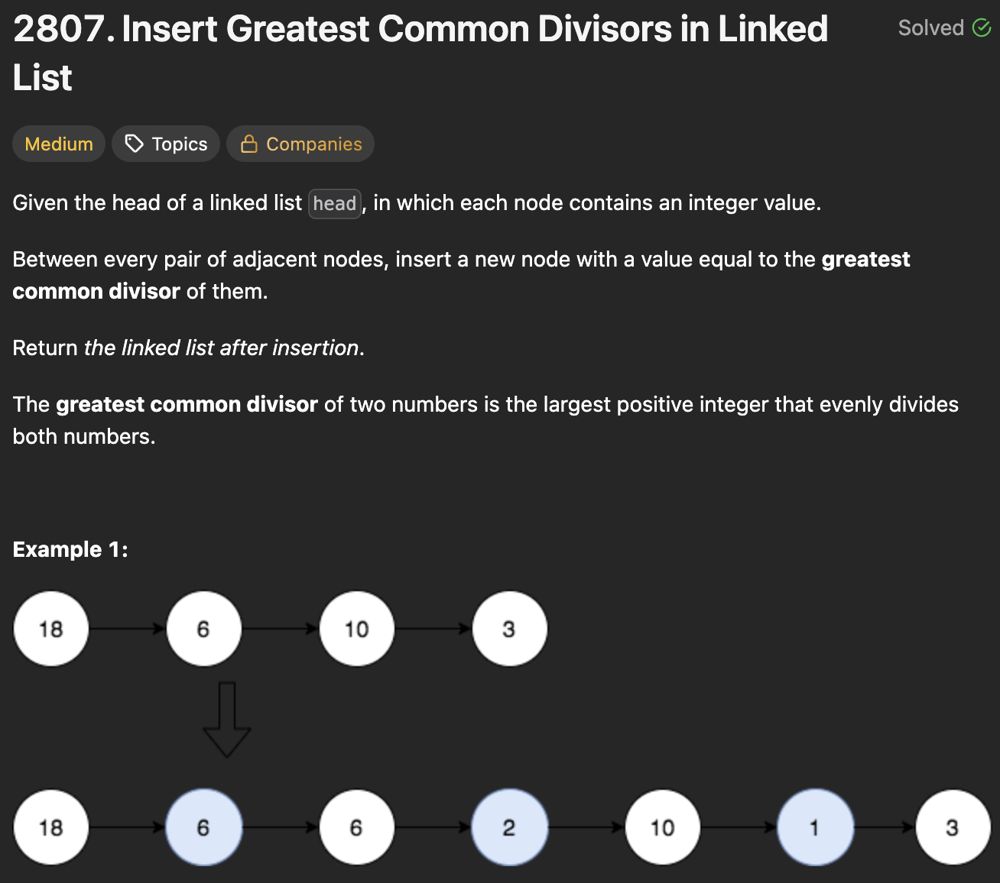

# 2807. Insert Greatest Common Divisors in Linked List

https://leetcode.com/problems/insert-greatest-common-divisors-in-linked-list/description/

## About

Итерируемся по связному списку и считаем НОД для каждого текущего и следующего элемента, пока след. элемент существует. Для вставки подменяем ссылки на следующие элементы

## Solved screenshot

