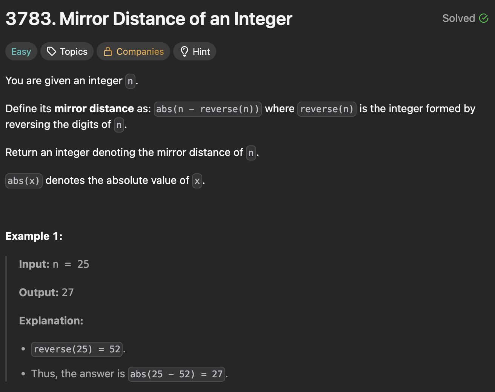

# 3783. Mirror Distance of an Integer

https://leetcode.com/problems/mirror-distance-of-an-integer/description/

## About

Для переворота числа переводим его в строку и разворачиваем с помощью шага -1 для среза из всего списка

## Solved screenshot

