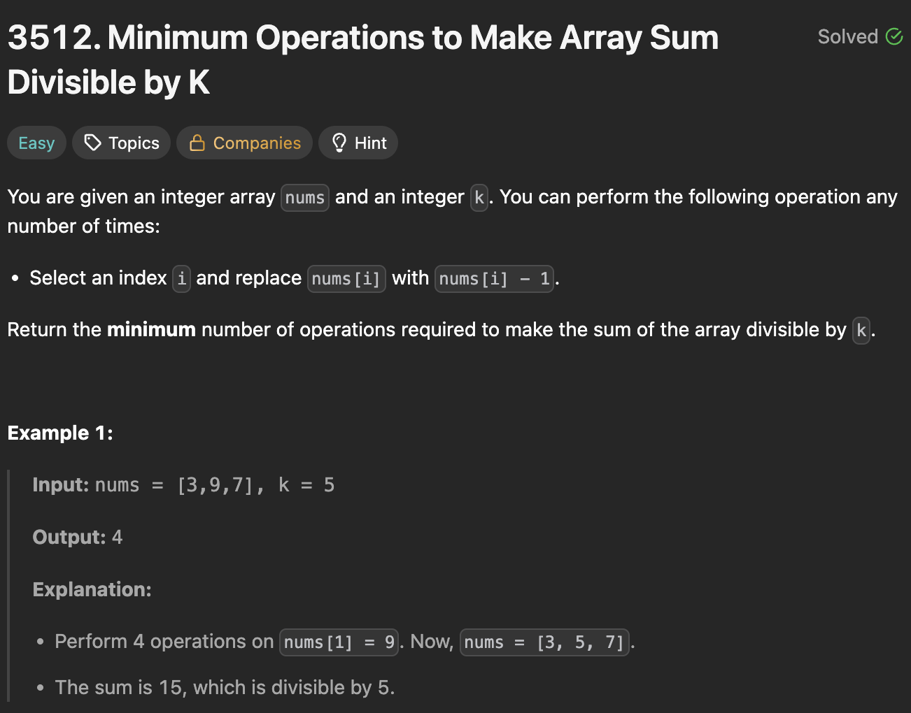

# 3512. Minimum Operations to Make Array Sum Divisible by K

https://leetcode.com/problems/minimum-operations-to-make-array-sum-divisible-by-k/description/

## About

С помощью деления по модулю получаем разницу между ближайшим минимальным числом, которое делится без остатка на сумму элементов списка.

## Solved screenshot

