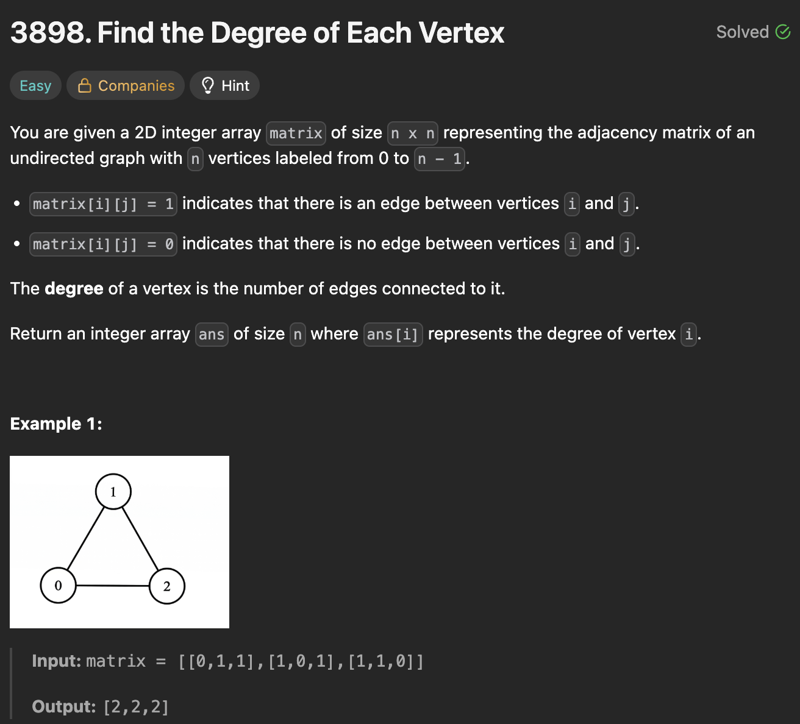

# 3898. Find the Degree of Each Vertex

https://leetcode.com/problems/find-the-degree-of-each-vertex/description/

## About

Т.к. каждый элемент списка хранит в себе связь с каждым другим элементом, для подсчёта связей достаточно посчитать сумму каждого вложенного списка.

## Solved screenshot

