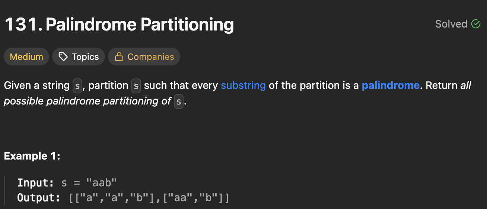

# 131. Palindrome Partitioning

https://leetcode.com/problems/palindrome-partitioning/description/

## About

Каждый элемент массива формируется с помощью обхода в глубину, где в случае наличия элемента-полиндрома, мы добавляем его в массив, обнуляем и запускаем dfs, где этот элемент всё ещё не обнулён (для кейсов типа "efeefe"), иначе добавляем к элементу символ справа.

## Solved screenshot

