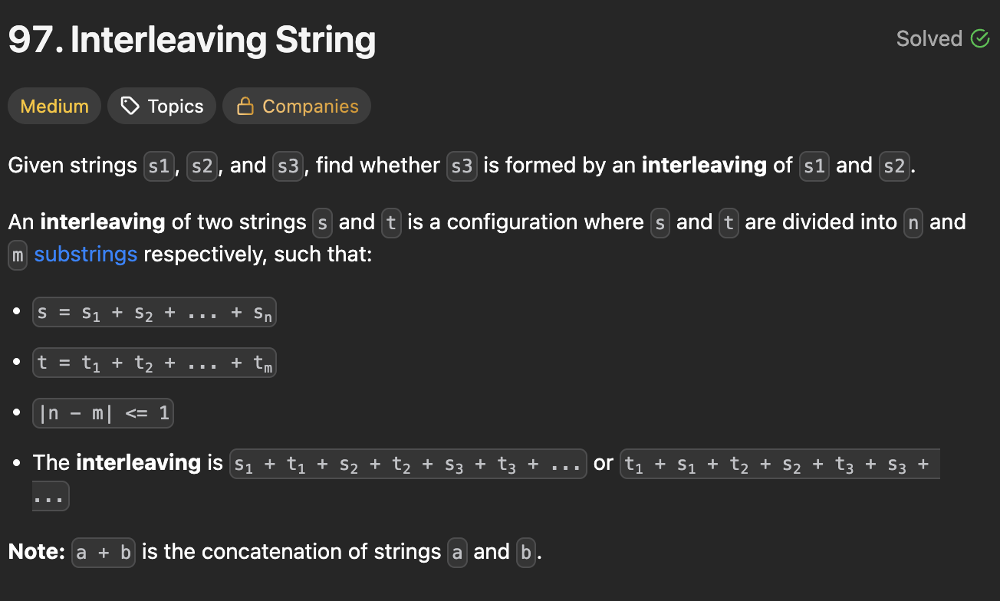

# 97. Interleaving String

https://leetcode.com/problems/interleaving-string/

## About

Формируем двумерный DP массив. Первыми двумя циклами формируем базу динамики. Далее ``dp[i][j] = (dp[i-1][j] and s1[i-1] == s3[i+j-1]) or (dp[i][j-1] and s2[j-1] == s3[i+j-1])``. Смысл DP для решения задачи для разной размерности s3

## Solved screenshot

