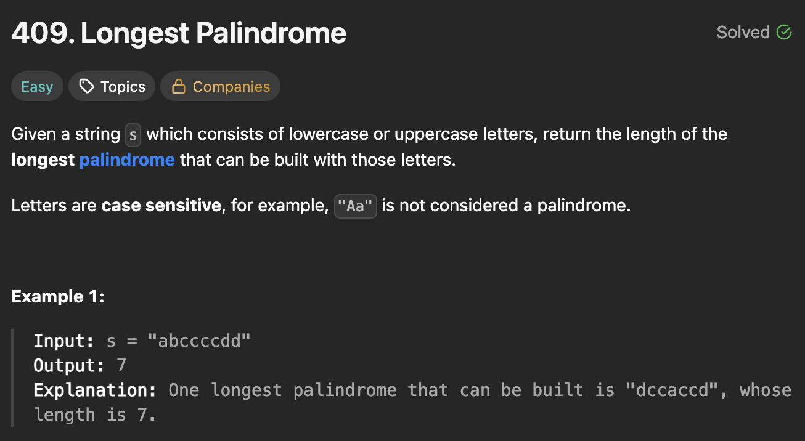

# 409. Longest Palindrome

https://leetcode.com/problems/longest-palindrome/description/

## About

Любые символы, которых чётное количество, можно использовать в полиндроме. Все нечётные символы можно использовать без 1 символа, при этом в середине можно использовать любой отброшенный символ из чётного числа символов.

## Solved screenshot

