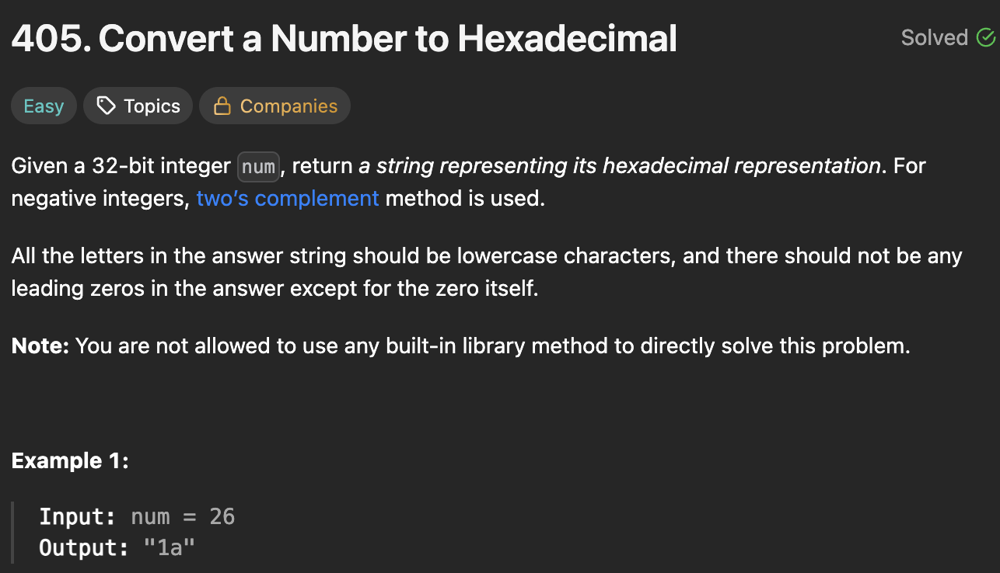

# 405. Convert a Number to Hexadecimal

https://leetcode.com/problems/convert-a-number-to-hexadecimal/description/

## About

Перевод положительного числа с отбрасыванием спец символов. Перевод отрицательного числа с помощью метода, указанного в задаче, который основан на использовании маски размером (2**32 - 1).

## Solved screenshot

