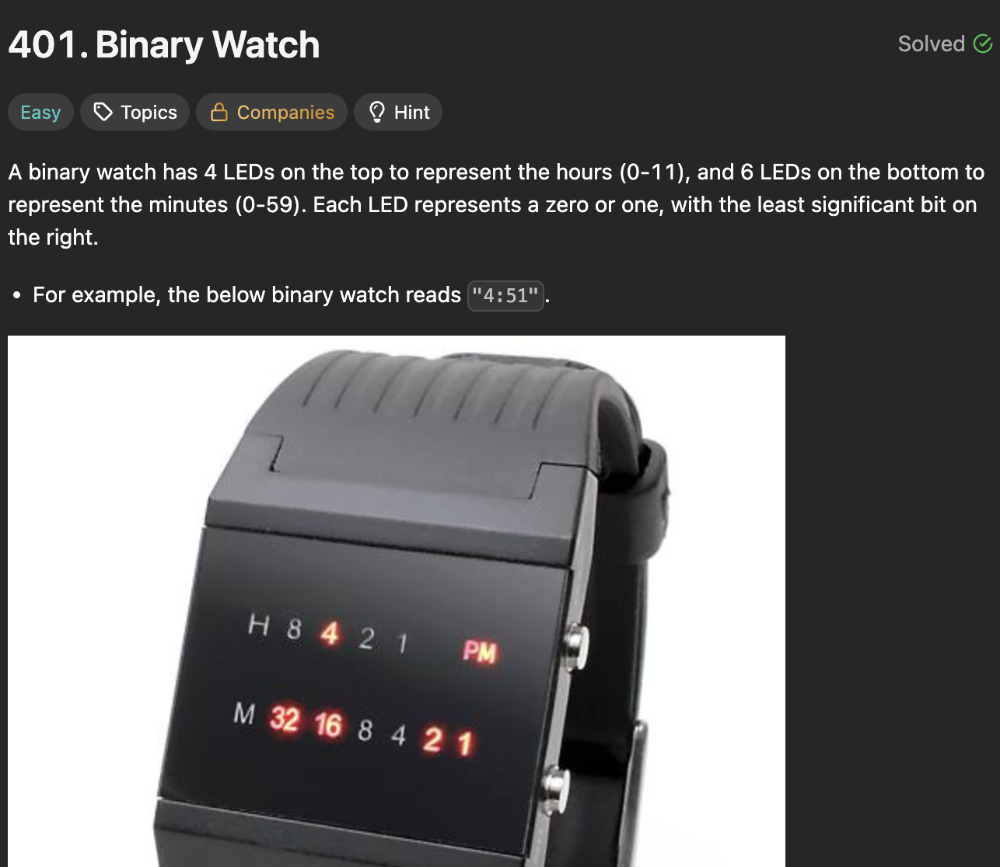

# 401. Binary Watch

https://leetcode.com/problems/binary-watch/

## About

Решение сводится к 2-м этапам:

1. Генерация всевозможных валидных комбинаций;
2. Конвертация полученных комбинаций во время.

Для генерация использован поиск в глубину (DFS) с базой рекурсии, не дающей создать невалидную комбинацию.

## Solved screenshot

