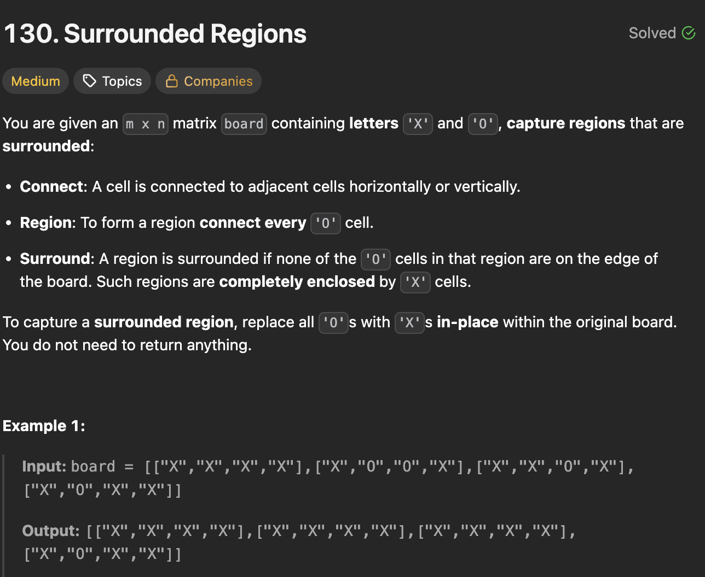

# 130. Surrounded Regions

https://leetcode.com/problems/surrounded-regions/

## About

Решение сводится к поиску компонент связности и итерации по их элементам с целью выявить граничащие с концом матрицы элементы, если такие найдены, то компонента пропускается, иначе все элементы компоненты меняются на X.

## Solved screenshot

