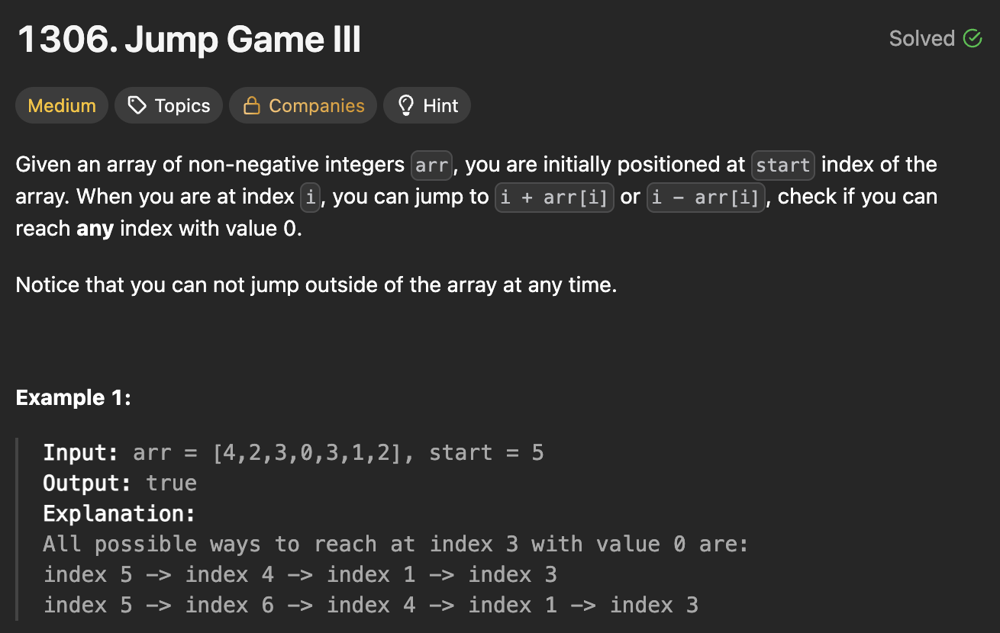

# 1306. Jump Game III

https://leetcode.com/problems/jump-game-iii/

## About

Используется BFS, игнорирующий уже использованные элементы для итерации только по уникальным индексам, пока не найдётся значение 0 или не закончатся возможные для посещения элементы.

## Solved screenshot

