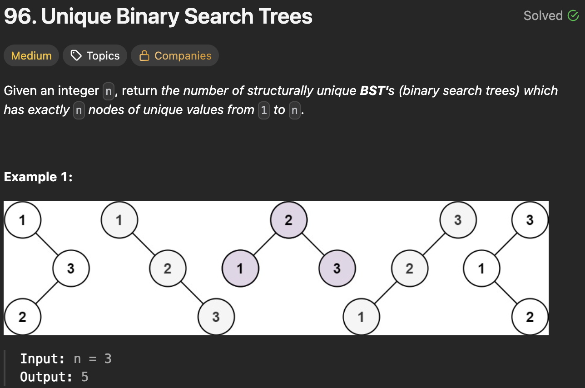

# 96. Unique Binary Search Trees

https://leetcode.com/problems/unique-binary-search-trees/

## About

Динамика, где dp[i] - количество уникальных деревьев для i узлов. Где количество узлов можно получить умножением левого и правого поддееревьев.

## Solved screenshot

