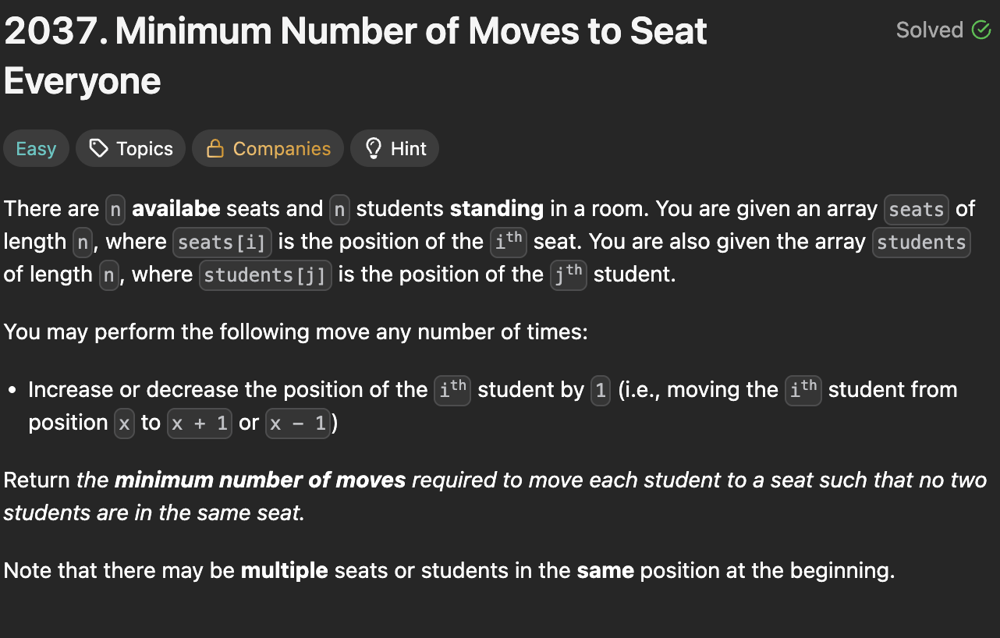

# 2037. Minimum Number of Moves to Seat Everyone

https://leetcode.com/problems/minimum-number-of-moves-to-seat-everyone/

## About

Сортируем места и студентов для получения ближайших пар студент-место и суммируем их абсолютную разницу.

## Solved screenshot

