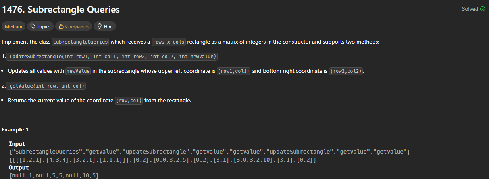

# 1476. Subrectangle Queries

https://leetcode.com/problems/subrectangle-queries/

## About

Итерируясь по прямоугольникам в указанном диапазоне строк и столбцов, меняем значение на `newVal`

## Solved screenshot

