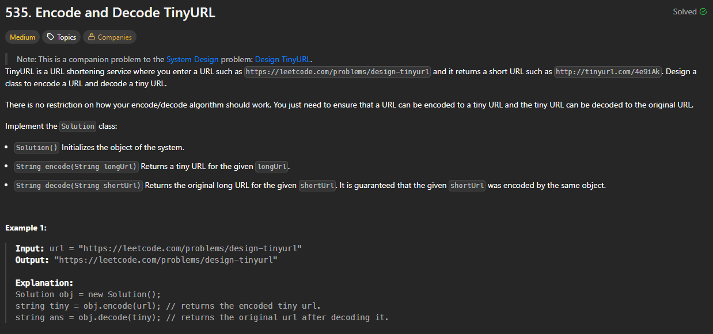

# 535. Encode and Decode TinyURL

https://leetcode.com/problems/encode-and-decode-tinyurl/description/

## About

Используя симметричный алгоритм шифрования, id записи сокращённого URL шифруется и дешифруется в заданном алфавите

## Solved screenshot

