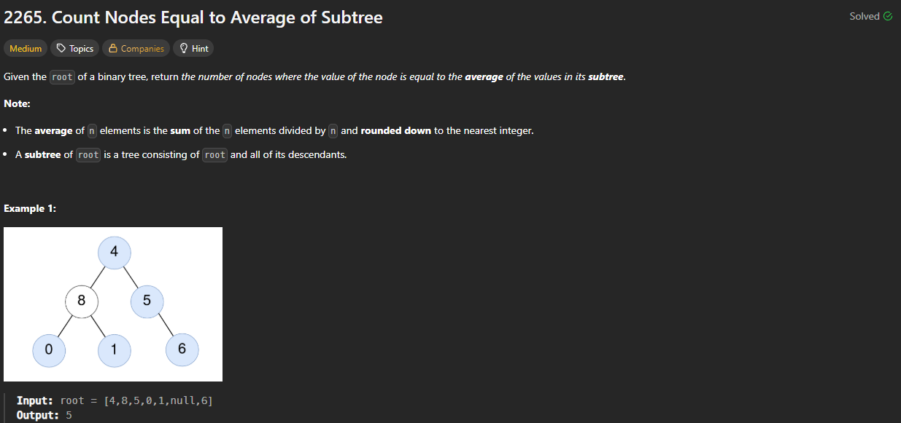

# 2265. Count Nodes Equal to Average of Subtree

https://leetcode.com/problems/count-nodes-equal-to-average-of-subtree/description/

## About

Для каждой ноды считаем левую и правую части, суммируем их и вместе с текущим значением считаем среднее, если оно совпадает с текущим, то результат увеличивается на 1

## Solved screenshot

