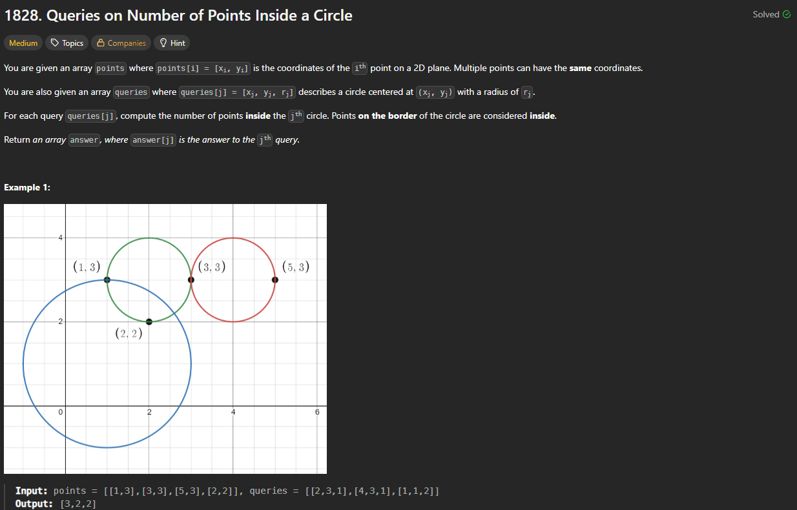

# 1828. Queries on Number of Points Inside a Circle

https://leetcode.com/problems/queries-on-number-of-points-inside-a-circle/description/

## About

Для каждого круга считаем расстояние до точек, если оно меньше или равно заданному радиусу, то результат увеличивается на 1

## Solved screenshot

