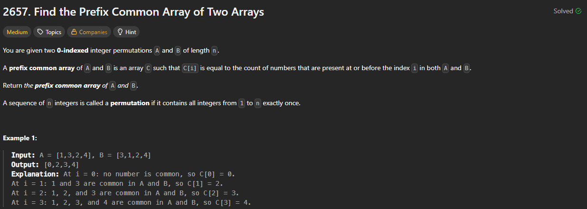

# 2657. Find the Prefix Common Array of Two Arrays

https://leetcode.com/problems/find-the-prefix-common-array-of-two-arrays/description/

## About

Используем множества для определения вхождения новых значений за O(1). Обрабатываем базу `[1 if A[0] == B[0] else 0]` отдельно

## Solved screenshot

