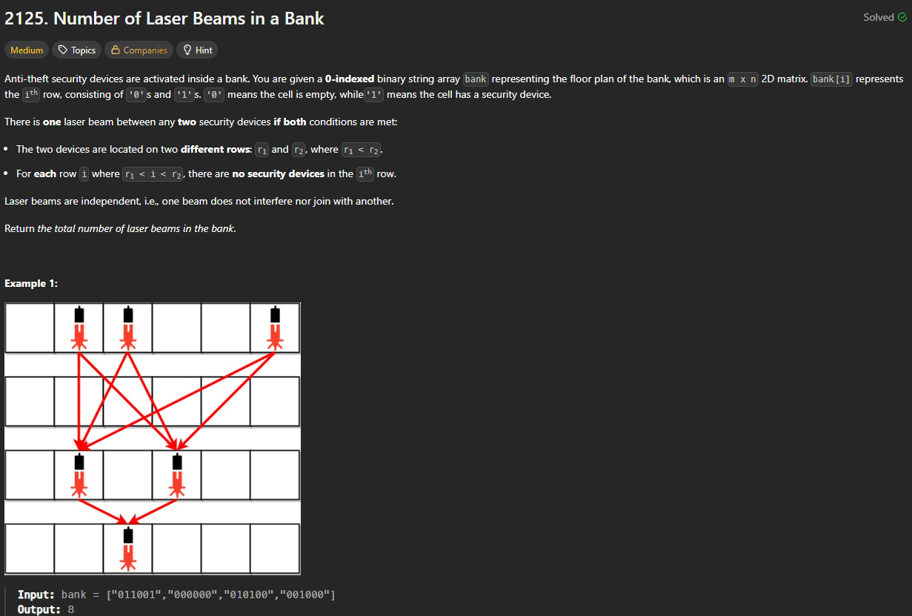

# 2125. Number of Laser Beams in a Bank

https://leetcode.com/problems/number-of-laser-beams-in-a-bank/description/

## About

Считаем количество лазеров в текущей строке и умножаем на количество в предыдущей строке, сохраняя текущее число в предыдущее

## Solved screenshot

