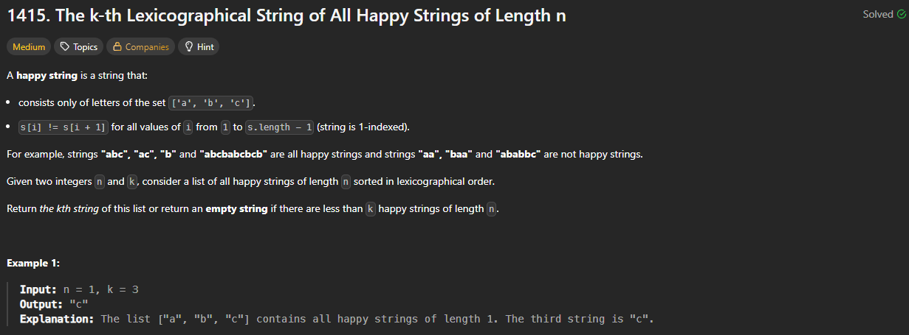

# 1415. The k-th Lexicographical String of All Happy Strings of Length n

https://leetcode.com/problems/the-k-th-lexicographical-string-of-all-happy-strings-of-length-n/description/

## About

С помощью BFS проходимся по всем комбинациям строк, при этом учитывая лексикографический порядок при инициализации базового массива и при добавлении нового элемента

## Solved screenshot

