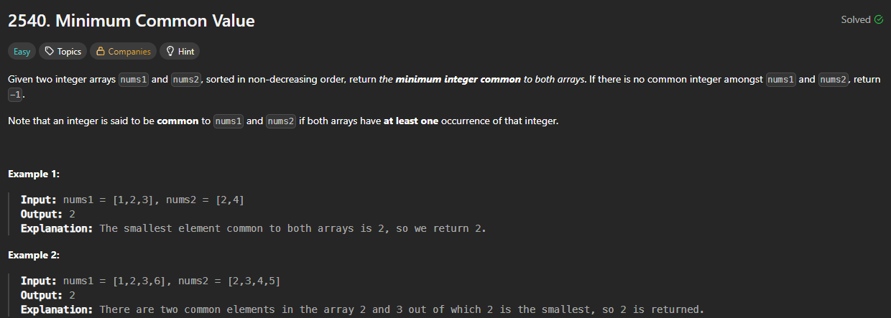

# 2540. Minimum Common Value

https://leetcode.com/problems/minimum-common-value/description/

## About

Приводим 1 массив к множеству и, итерируясь по второму, определяем минимальное общее число

## Solved screenshot

