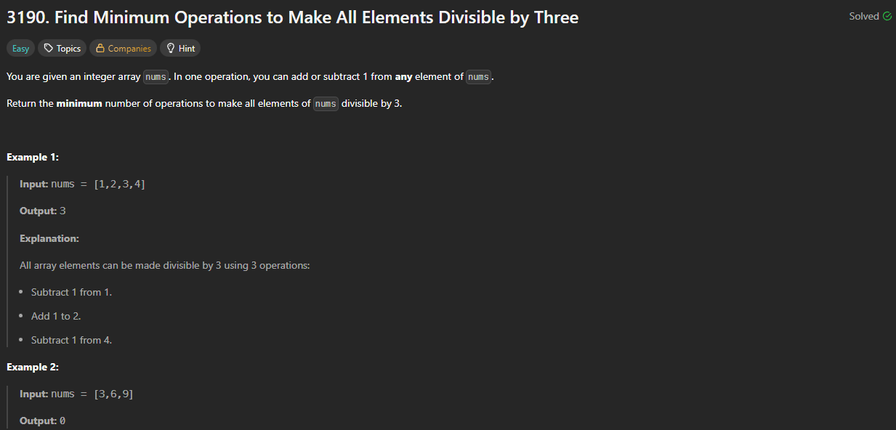

# 3190. Find Minimum Operations to Make All Elements Divisible by Three

https://leetcode.com/problems/find-minimum-operations-to-make-all-elements-divisible-by-three/

## About

Всё сводится к работе с цифрами 0 - 1 - 2 - 3, если mod от числа == 1 или == 2, значит нужно либо прибавить, либо убавить 1. Для задачи сути это не имеет. Либо не нужно прибавлять и число делится на 3 без остатка.

## Solved screenshot

