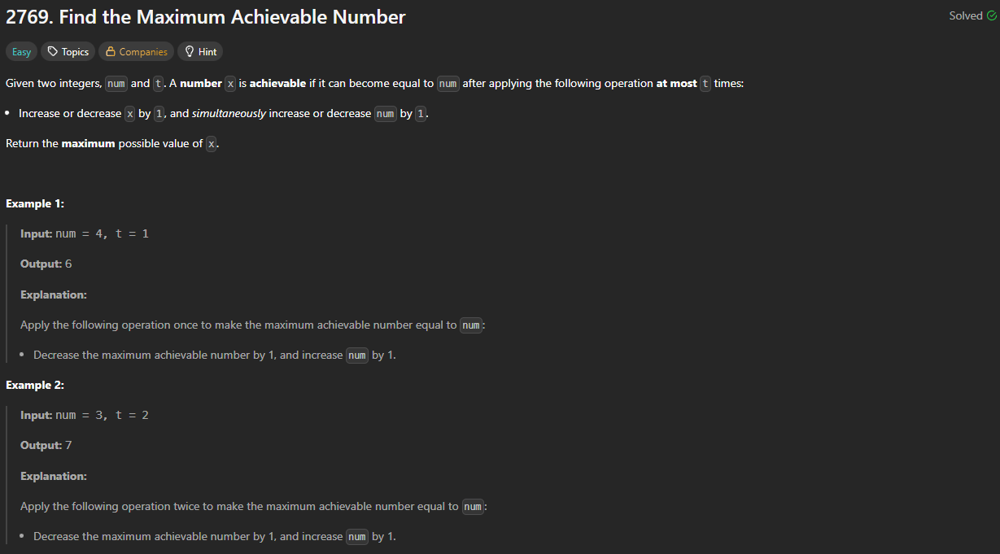

# 2769. Find the Maximum Achievable Number

https://leetcode.com/problems/find-the-maximum-achievable-number/

## About

Уменьшаем макс. число и увеличиваем num == "+ t * 2".

## Solved screenshot

