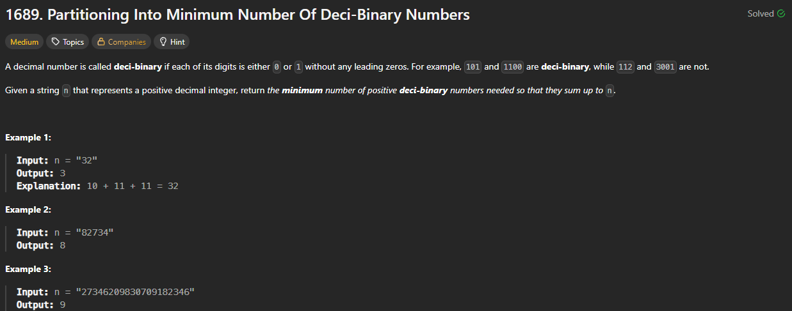

# 1689. Partitioning Into Minimum Number Of Deci-Binary Numbers

https://leetcode.com/problems/partitioning-into-minimum-number-of-deci-binary-numbers/

## About

Минимальное число достагается за счёт прибавления единицы max(n) раз.

## Solved screenshot

